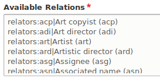
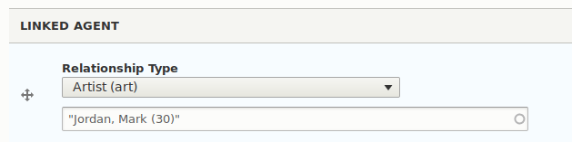
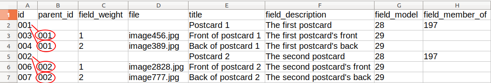
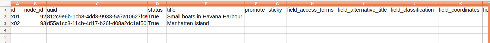

# Islandora Workbench

A command-line tool that allows creation, updating, and deletion of Islandora content from CSV data. Islandora Workbench is an alternative to using Drupal's built-in Migrate tools for [ingesting Islandora content from CSV files](https://github.com/Islandora/migrate_islandora_csv). Unlike the Migrate tools, Islandora Workbench can be run anywhere - it does not need to run on the Islandora server. 

A companion project under development, [Islandora Workbench Desktop](https://github.com/mjordan/islandora_workbench_desktop), adds a graphical user interface that enables users not familiar or comfortable with the command line to use Workbench.

This tool is not related in any way to the Drupal contrib module called [Workbench](https://www.drupal.org/project/workbench).

## Requirements

* Python 3.2 or higher
   * The [ruamel.yaml](https://yaml.readthedocs.io/en/latest/index.html) library
   * The [Requests](https://2.python-requests.org/en/master/) library
* An [Islandora 8](https://islandora.ca/) repository
   * The JSON:API module is not enabled by default. You must enable it manually.
   * If you want Workbench to validate the existence of taxonomy term IDs/names used in your CSV input file (very much advised), you need to install and enable the [Islandora Workbench Integration](https://github.com/mjordan/islandora_workbench_integration) module.
   * If you want to be able to create new taxonomy terms by including term names in your CSV data, you need to:
      * Install and enable the Islandora Workbench Integration module on your target Drupal and
      * Your target Drupal needs to have its "Taxonomy term" REST endpoint enabled. To do so:
         * Go to `admin/config/services/rest`
         * Next to "Taxonomy term" in the list of disabled resource names, click on the "Enable" button.
         * Set "Granularity" to "Method" and check "GET", "Accepted request formats" to "JSON", and "Authentication providers" to "basic_auth".
         * Click on the "Save configuration" button.

While installing the Islandora Workbench Integration module is currently optional as described above, it will likely become required in the future.

## Installation

* `git clone https://github.com/mjordan/islandora_workbench.git`

If you don't already have the two required libraries installed, clone this repo as above, and then use `setup.py`:

* `sudo python3 setup.py install`

## Usage

`./workbench --config config.yml --check`

then

`./workbench --config config.yml`  

## The configuration file

Workbench uses a YAML configuration whose location is indicated in the `--config` parameter. This file defines the various options it will use to create, update, or delete Islandora content (such as which CSV file to use and what directory your images are in). An example configuration file is:

```yaml
task: create
host: "http://localhost:8000"
username: admin
password: islandora
content_type: islandora_object
input_dir: input_data
input_csv: metadata.csv
media_use_tid: 17
media_type: image
drupal_filesystem: "fedora://"
id_field: id
```

The settings defined in a configuration file are:

| Setting | Required | Default value | Description |
| --- | --- | --- | --- | 
| task | ✔️ | | One of 'create', 'create_from_files', update', delete', 'add_media', or 'delete_media' |
| host | ✔️ | | The hostname, including port number if not 80, of your Islandora repository. |
| username |  ✔️ | | The username used to authenticate the requests. |
| password |  ✔️ | | The user's password. |
| content_type |  ✔️ | | The machine name of the Drupal node content type you are creating or updating. |
| input_dir |  ✔️ | | The full or relative path to the directory containing the files and metadata CSV file. |
| input_csv |  ✔️ | | The name of the CSV metadata file, which must be in the directory named in `input_dir`. |
| log_file_path | | workbench.log | The path to the log file, absolute or relative to `workbench`. See the "Logging" section below for more information. |
| id_field |  | id | The name of the field in the CSV that uniquely identifies each record. |
| delimiter |  | , [comma]| The delimiter used in the CSV file, for example, "," or "\t". If omitted, defaults to ",". |
| subdelimiter |  | &#124; [pipe]| The subdelimiter used in the CSV file to define multiple values in one field. If omitted, defaults to "&#124;". |
| drupal_filesystem |  ✔️ | | One of 'fedora://', 'public://', or 'private://'. |
| output_csv | | | The full or relative path to a CSV file with one record per node created by Workbench. See "The output CSV file" section below for more information. |
| media_use_tid |  ✔️ |  | The term ID for the Media Use term you want to apply to the media. |
| media_type [singular] |  | | Specifies whether the media being created in the 'create' or 'add_media' task is an image, file, document, audio, or video (or other media type that exists in the target Islandora). One of `media_type` or `media_types` is required. |
| media_types [plural] |  | | Provides a mapping bewteen file extensions and media types. Note: one of `media_type` or `media_types` is required. More detail provided in the "Setting Media Types" section below. |
| allow_missing_files |  | false | Determines if empty `file` values are allowed. If set to true, empty file values are allowed and will result in nodes without attached media. Defaults to false (which means all file values must contain the name of a file that exists in the `input_data` directory). |
| allow_adding_terms |  | false | Determines if Workbench will add taxonomy terms if they do not exist in the target vocabulary. See more information in the "Taxonomy fields" section below. |
| published | | true | Whether nodes are published or not. Applies to 'create' task only. Set to false if you want the nodes to be unpublished. Note that whether or not a node is published can also be set at a node level in the CSV file in the status base field, as described in the "Base Fields" section below. Values in the CSV override the value of published set here. |
| validate_title_length |  | true | Whether or not to check if title values in the CSV exceed Drupal's maximum allowed length of 255 characters. Defaults to true. Set to false if you are using a module that lets you override Drupal's maximum title length, such as Node Title Length or Entity Title Length. Also, if your task is `update`, you should set this to false if `title` is not one of the fields you are updating. |
| pause |  | | Defines the number of seconds to pause between each REST request to Drupal. Include it in your configuration to lessen the impact of Islandora Workbench on your site during large jobs, for example pause: 1.5. |
| delete_media_with_nodes |  | true | When a node is deleted using a delete task, by default, all if its media are automatically deleted. Set this option to false to not delete all of a node's media (you do not generally want to keep the media without the node). |
| paged_content_from_directories |  | false | Set to true if you are using the "Without page-level metadata" method of creating paged content. See the section "Creating paged content" below for more information. |
| paged_content_sequence_seprator |  | - [hyphen]| The character used to separate the page sequence number from the rest of the filename. Used when creating paged content with the "Without page-level metadata" method. See the section "Creating paged content" below for more information. |
| paged_content_page_model_tid |  | | Required if `paged_content_from_directories` is true. The the term ID from the Islandora Models taxonomy to assign to pages. See the section "Creating paged content" below for more information. |
| paged_content_page_display_hints |  | | The term ID from the Islandora Display taxonomy to assign to pages. If not included, defaults to the value of the `field_display_hints` in the parent's record in the CSV file. See the section "Creating paged content" below for more information. |
| paged_content_page_content_type |  | | Set to the machine name of the Drupal node content type for pages created using the "Without page-level metadata" method if it is different than the content type of the parent (which is specified in the content_type setting). See the section "Creating paged content" below for more information. |
| log_json |  | false | Whether or not to log the raw JSON POSTed, PUT, or PATCHed to Drupal. Useful for debugging. |
| bootstrap |  | | Absolute path to one or more scripts that execute prior to Workbench connecting to Drupal. Scripts can be in any language, and need to be executable. For an example of using this feature to run a script that generates sample Islandora content, see the "Generating sample Islandora content" section below. |
| model [singular]|  |  | Used in the create_from_files task only. Defines the term ID from the the "Islandora Models" vocabulary for all nodes created using this task. Note: one of `model` or `models` is required. More detail provided in the "Creating nodes from files only" section below.|
| models [plural] |  |  | Used in the create_from_files task only. Provides a mapping bewteen file extensions and terms in the "Islandora Models" vocabulary. Note: one of `model` or `models` is required. More detail provided in the "Creating nodes from files only" section below.|

## Checking configuration and input data

You should always (always, [I can't stress that enough](https://www.youtube.com/watch?v=2ZgtEdFAg3s)) check your configuration and input prior to creating, updating, or deleting content. You can do this by running Workbench with the `--check` option, e.g.:

`./workbench --config config.yml --check`

If you do this, Workbench will check the following and report any errors that require your attention before proceding:

* Whether your configuration file contains all required values.
* Whether the `host` you provided will accept the `username` and `password` you provided.
* Whether your CSV file contains required columns headers, including the field defined as the unique ID for each record (defaults to "id" if the `id_field` key is not in your config file)
* Whether your CSV column headers correspond to existing Drupal field machine names.
* Whether all Drupal fields that are configured to be required are present in the CSV file.
* Whether multivalued fields exceed their allowed number of values.
* Whether the files named in the CSV file are present (but this check is skipped if `allow_missing_files: true` is present in your config file for "create" tasks).
* If the `langcode` field is present in your CSV, whether values in it are valid Drupal language codes.
* Whether values in the `title` field exceed Drupal's maximum length for titles of 255 characters (but this check is skipped if `validate_title_length` is set to `False`).
* Whether values in text-type fields exceed their configured maximum length.
* Whether either `media_type` or `media_types` is present in your configuration file.
* Whether each row contains the same number of columns as there are column headers.
* Whether the nodes refrenced in `field_member_of` (if that field is present in the CSV) exist.
* Whether the columns required to create paged content are present (see "Creating paged content" below).
* Whether your Islandora has the [Workbench Integration](https://github.com/mjordan/islandora_workbench_integration) module enabled.
   * If not, Workbench will recommend that you enable it.
   * If so, Workbench will validate whether taxonomy term IDs or term names (such as those used in `field_model`) exist in the referenced taxonomies
* If using the pages from directories configuration:
   * Whether page filenames contain an occurance of the sequence separator.
   * Whether any page directories are empty.

You will probably need to run Workbench using `--check` a few times before you will be ready to run it without `--check` and commit your data to Islandora. For example, you may need to correct errors in taxonomy term IDs or names, fix errors in media filenames, or wrap values in your CSV files in quotation marks.

It's also a good idea to check the Workbench log file after running `--check`. All warnings and errors are printed to the console, but the log file may contain additional information or detail that will help you resolve issues.

Once you have used `--check` to detect all of the problems with your CSV data, committing it to Islandora will work very reliably.

## Creating nodes from the sample data

Using the sample data and configuration file, the output of `./workbench --config create.yml` should look something like:

```
Node for 'Small boats in Havana Harbour' created at http://localhost:8000/node/52.
+File media for IMG_1410.tif created.
Node for 'Manhatten Island' created at http://localhost:8000/node/53.
+File media for IMG_2549.jp2 created.
Node for 'Looking across Burrard Inlet' created at http://localhost:8000/node/54.
+Image media for IMG_2940.JPG created.
Node for 'Amsterdam waterfront' created at http://localhost:8000/node/55.
+Image media for IMG_2958.JPG created.
Node for 'Alcatraz Island' created at http://localhost:8000/node/56.
+Image media for IMG_5083.JPG created.
```

## Using your own input data

### The files

The directory that contains the data to be ingested (identified by the `input_dir` config option) needs to contain a CSV file with field content and any accompanying media files you want to add to the newly created nodes:

```
your_folder/
├── image1.JPG
├── pic_saturday.jpg
├── image-27262.jpg
├── IMG_2958.JPG
├── someimage.jpg
└── metadata.csv
```

The names of the image/PDF/video/etc. files can take any form you want since they are included in the `file` column of the CSV file. Files of any extension are allowed.

By defualt, if the `file` value for a row is empty, Workbench's `--check` option will show an error. But, in some cases you may want to create a node but not add any media. If you add `allow_missing_files: true` to your config file for "create" tasks, you can leave the `file` cell in your CSV for that item empty.

### The CSV file

Metadata that is to be added to new or existing nodes is contained in the CSV file. As is standard with CSV data, field values do not need to be wrapped in double quotation marks (`"`), unless they contain an instance of the delimiter character (e.g., a comma). Field values are either strings (for string or text fields), integers (for `field_weight`, for example), `1` or `0` for binary fields, Drupal-generated IDs (term IDs taxonomy terms or node IDs for collections and parents), or structured strings (for typed relation and geolocation fields)

Single-valued and multi-valued fields of the following types can be added:

* base fields
* text (plain, plain long, etc.) fields
* integer fields
* boolean fields, with values 1 or 0
* EDTF date fields
* entity reference (taxonomy and linked node) fields
* typed relation (taxonomy and linked node) fields
* geolocation fields

#### Required fields

* For the `create` task, `title`, `id` (or whatever field is identified in the `id_field` configuration option), and `file` are required. Empty values in the `file` field are allowed, in which case a node will be created but it will have no attached media.
* For the `update`, `delete`, and `add_media` tasks, the `node_id` field is required.
* For the `add_media` task, `file` is required, but for this task, `file` must contain a filename.
 
#### Base fields

Base fields are basic node properties, shared by all content types. The base fields you can include in your CSV file are:

* `title`: This field is required for all rows in your CSV for the `create` task. Optional for the 'update' task. Drupal limits the title's length to 255 characters, and Workbench will check that titles are less than 255 characters unless your configuration file contains `validate_title_length: False` as described above.
* `promote`: Promoted to front page. Optional. If included, use `1` (promoted) or `0` (not promoted) as values. If absent, is set to the default value for your content type.
* `status`: Whether the node is published. Optional. If included, use `1` (published) or `0` (unpublished) as values. If absent, is set to the default value for your content type.
* `sticky`: Sticky at top of lists. Optional. If included, use `1` (sticky) or `0` (not sticky) as values. If absent, is set to the default value for your content type.
* `langcode`: The language of the node. Optional. If included, use one of Drupal's language codes as values (common values are 'en', 'fr', and 'es'; the entire list can be seen [here](https://git.drupalcode.org/project/drupal/-/blob/8.8.x/core/lib/Drupal/Core/Language/LanguageManager.php#L224). If absent, Drupal sets the value to the default value for your content type.

#### Single-valued fields

You can include additional fields that will be added to the nodes. The column headings in the CSV file must match machine names of fields that exist in the target Islandora content type.

For example, using the fields defined by the Islandora Defaults module for the "Repository Item" content type, your CSV file could look like this:

```csv
file,title,id,field_model,field_description,field_rights,field_extent,field_access_terms,field_member_of
myfile.jpg,My nice image,obj_00001,24,"A fine image, yes?",Do whatever you want with it.,There's only one image.,27,45
```

In this example, the term ID for the tag you want to assign in `field_access_terms` is 27, and the node ID of the collection you want to add the object to (in `field_member_of`) is 45.

#### Multivalued fields

For multivalued fields, separate the values within a field with a pipe (`|`), like this:

```
file,title,field_my_multivalued_field
IMG_1410.tif,Small boats in Havana Harbour,foo|bar
IMG_2549.jp2,Manhatten Island,bif|bop|burp
```

This works for string fields as well as reference fields, e.g.:

```
file,title,field_my_multivalued_taxonomy_field
IMG_1410.tif,Small boats in Havana Harbour,35|46
IMG_2549.jp2,Manhatten Island,34|56|28
```

Drupal strictly enforces the maximum number of values allowed in a field. If the number of values in your CSV file for a field exceed a field's configured maximum number of fields, Workbench will only populate the field to the field's configured limit.

The subdelimiter character defaults to a pipe (`|`) but can be set in your config file using the `subdelimiter: ";"` option.

#### Typed Relation fields

Unlike most field types, which take a string or an integer as their value in the CSV file, fields that have the "Typed Relation" type take structured values that need to be entered in a specific way in the CSV file. An example of this type of field is the "Linked Agent" field in the Repository Item content type created by the Islandora Defaults module.

The structure of values for this field encode a namespace (indicating the vocabulary the relation is from), a relation type, and a target ID (which identifies what the relation refers to, such as a specific taxonomy term), each separated by a colon (`:`). The first two parts, the namespace and the relation type, come from the "Available Relations" section of the field's configuration, which looks like this (using the "Linked Agent" field's configuration as an exmple):



In the node edit form, this structure is represented as a select list of the types (the namespace is not shown) and, below that, an autocomplete field to indicate the relation target, e.g.:



To include these kind of values in a CSV field, we need to use a structured string as described above (namespace:relationtype:targetid). For example:

`relators:art:30`

> Note that the structure required for typed relation values in the CSV file is not the same as the structure of the relations configuration depicted in the first screenshot above; the CSV values use only colons to seprate the three parts, but the field configuration uses a colon and then a pipe (|) to structure its values.

In this example of a CSV value, `relators` is the namespace that the relation type `art` is from (the Library of Congress [Relators](http://id.loc.gov/vocabulary/relators.html) vocabulary), and the target taxonomy term ID is `30`. In the screenshot above showing the "Linked Agent" field of a node, the value of the Relationship Type select list is "Artist (art)", and the value of the associated taxonomy term field is the person's name that has the taxonomy term ID "30" (in this case, "Jordan, Mark"):

If you want to include multiple typed relation values in a single field of your CSV file (such as in "field_linked_agent"), separate the three-part values with the same subdelimiter character you use in other fields, e.g. (`|`) (or whatever you have configured as your `subdelimiter`):

`relators:art:30|relators:art:45`

### Taxonomy fields

In CSV columns for taxonomy fields, you can use either term IDs (integers) or term names (strings). You can even mix IDs and names in the same field:

```
file,title,field_my_multivalued_taxonomy_field
img001.png,Picture of cats and yarn,Cats|46
img002.png,Picture of dogs and sticks,Dogs|Sticks
img003.png,Picture of yarn and needles,"Yarn, Balls of"|Knitting needles
```
By default, if you use a term name in your CSV data that doesn't match a term name that exists in the referenced taxonomy, Workbench will detect this when you use `--check` and exit. However, if you add `allow_adding_terms: true` to your configuration file for `create` and `update` tasks, Workbench will create the new term. A few of things to note:

* To create new terms, your target Drupal needs to have its "Taxonomy term" REST endpoint enabled as described in the "Requirements" section at the beginning of this README.
* If multiple records in your CSV contain the same new term name in the same field, the term is only created once.
* When Workbench checks to see if the term with the new name exists in the target vocabulary, it normalizes it and compares it with existing term names in that vocabulary, applying these normalization rules to both the new term and the existing terms:
   * It strips all leading and trailing whitespace.
   * It replaces all other whitespace with a single space character.
   * It converts all text to lower case.
   * It removes all punctuation.
   * If the term name you provide in the CSV file does not match any existing term names in the vocabulary linked to the field after these normalization rules are applied, it is used to create a new taxonomy term. If it does match, Workbench populates the field in your nodes with the matching term.
   
Adding new terms has some contraints:

* Creating taxonomy terms by including them in your CSV file adds new terms to the root of the applicable vocabulary. You cannot create new terms that have another term as its parent (i.e. terms below the top leve of a hierarchical taxonomy). However, for existing terms, Workbench doesn't care where they are in a taxonomy's hierarchy.
* Terms created in this way do not have any external URIs. If you want your terms to have external URIs, you will need to either create the terms manually or add the URIs manually after the terms are created by Islandora Workbench.
* Taxonomy terms created with new nodes are not removed when you delete the nodes.

#### Using term names in multi-taxonomy fields

While most node taxonomy fields reference only a single taxonomy, Drupal does allow fields to reference multiple taxonomies. This ability poses a problem when we use term names instead of term IDs in our CSV files: in a multi-taxonomy field, Workbench can't be sure which term name belongs in which of the multiple taxonomies referenced by that field. This applies to both existing terms and to new terms we want to add when creating node content.

To avoid this problem, we need to tell Workbench which of the multple vocabularies each term name should (or does) belong to. We do this by namespacing terms with the applicable vocabulary ID.

For example, let's imagine we have a node field whose name is `field_sample_tags`, and this field references two taxonomies, `cats` and `dogs`. To use the terms `Tuxedo`, `Tabby`, `German Shepherd` in the CSV when adding new nodes, we would namespace them like this:


```
field_sample_tags
cats:Tabby
cats:Tuxedo
dogs:German Shepherd
```

If you want to use multiple terms in a single field, you would namespace them both:

```
cats:Tuxedo|cats:Misbehaving
```

Term names containing commas (`,`) in multi-valued, multi-taxonomy fields need special treatment (no surprise there): you need to wrap the entire field in quotation marks (like you would for any other CSV value that contains a comma), and in addition, specify the namespace within each of the values:

```
"tags:gum, Bubble|tags:candy, Hard"
```
Using these conventions, Workbench will be certain which taxonomy the term names belong to. Workbench will remind you during its `--check` operation that you need to namespace terms. It determines 1) if the field references multiple taxonomies, and then checks to see 2) if the field's values in the CSV are term IDs or term names. If you use term names in multi-taxonomy fields, and the term names aren't namespaced, Workbench will warn you:

```
Error: Term names in multi-vocabulary CSV field "field_tags" require a vocabulary namespace; value "Dogs" in row 4 does not have one.
```

Note that since `:` is a special character when you use term names in multi-taxonomy CSV fields, you can't add a namespaced term that itself contains a `:`. You need to add it manually to Drupal and then use its term ID in your CSV file.

### Geolocation fields

The Geolocation field type, managed by the [Geolocation Field](https://www.drupal.org/project/geolocation) contrib module, stores latitude and longitude coordinates in separate data elements. To add or update fields of this type, Workbench needs to provide the latitude and longitude data in these separate elements.

To simplify entering geocoordinates in the CSV file, Workbench allows geocoordinates to be in `lat,lng` format, i.e., the latitude coordinate followed by a comma followed by the longitude coordinate. When Workbench reads your CSV file, it will split data on the comma into the required lat and lng parts. An example of a single geocoordinate in a field would be:

```
field_coordinates
"49.16667,-123.93333"
```

You can include multiple pairs of geocoordinates in one CSV field if you separate them with the subdelimiter character:

```
field_coordinates
"49.16667,-123.93333|49.25,-124.8"
```

Notice that these fields need to be wrapped in double quotation marks, unless the `delimiter` key in your configuration file is set to something other than a comma.

## Setting media types

The media type for a given file (for example, `image`, `file`, `document`, `audio`, or `video`) can be set in two ways in Workbench's configuration for `create` and `add_media` tasks. One of the following two configuration options is required.

1. Globally, via the `media_type` configuration option. If this is present (for example `media_type: document`), all media created by Workbench will be assigned that media type. Use this option if all of the files in your batch are to be assigned the same media type.
1. On a per-file basis, via a mapping from file extensions to media types. This is done by including a mapping in the `media_types` option (notice the plural) in your configuration file like this one:

   ```
   media_types:
    - file: ['tif', 'tiff', 'jp2', 'zip', 'tar']
    - document: ['pdf', 'doc', 'docx', 'ppt', 'pptx']
    - image: ['png', 'gif', 'jpg', 'jpeg']
    - audio: ['mp3', 'wav', 'aac']
    - video: ['mp4']
    - extracted_text: ['txt']
   ```
   Use this option if the files in your batch are not to be assigned the same media type. If a file's extension is not in one of the extension lists, the media is assigned the `file` type.

If both `media_type` and `media_types` are included in the config file, the mapping is ignored and the media type assigned in `media_type` is used.

## Creating paged and compound content

Islandora Workbench provides two ways to create paged content. The first uses a specific directory structure to define the relationship between the parent item and the pages, and the second uses page-level metadata in the CSV to establish that relationship.

### Using subdirectories

Enable this method by including `paged_content_from_directories: true` in your configuration file. Use this method when you are creating books, newspaper issues, or other paged content where your pages don't have their own metadata. This method groups page-level files into subdirectories that correspond to each parent, and does not require (or allow) page-level metadata in the CSV file. Each parent (book, newspaper issue, etc.) has a row on the CSV file, e.g.:

```
id,title,field_model,field_display_hints
book1,How to Use Islandora Workbench like a Pro,28,2
book2,Using Islandora Workbench for Fun and Profit,28,2
```
Each parent's pages are located in a subdirectory of the input directory that is named to match the value of the `id` field of the parent item they are pages of:

```
samplebook/
├── book1
│   ├── page-001.jpg
│   ├── page-002.jpg
│   └── page-003.jpg
├── book2
│   ├── isbn-1843341778-001.jpg
│   ├── using-islandora-workbench-page-002.jpg
│   └── page-003.jpg
└── metadata.csv
```

The page filenames have significance. The sequence of the page is determined by the last segment of each filename before the extension, and is separated from the rest of the filename by a dash (`-`), although you can use another character by setting the `paged_content_sequence_seprator` option in your configuration file. For example, using the filenames for "book1" above, the sequence of "page-001.jpg" is "001". Dashes (or whatever your separator character is) can exist elsewhere in filenames, since Workbench will always use the string after the *last* dash as the sequence number; for example, the sequence of "isbn-1843341778-001.jpg" for "book2" is also "001". Workbench takes this sequence number, strips of any leader zeros, and uses it to populate the `field_weight` in the page nodes, so "001" becomes a weight value of 1, "002" becomes a weight value of 2, and so on.

Titles for pages are generated automatically using the pattern `parent_title` + `, page` + `sequence_number`, where "parent title" is inherited from the page's parent node and "sequence number" is the page's sequence. For example, if a page's parent has the title "How to Write a Book" and its sequence number is 450, its automatically generated title will be "How to Write a Book, page 450".

Finally, even though only minimal metadata is assigned to pages using this method (i.e., the automatically generated title and Islandora model), you can add additional metadata to pages using a separate `update` task.

Important things to note when using this method:

* To use this method of creating paged content, you must include the following in your configuration file:
   * `paged_content_sequence_seprator: true`
   * `paged_content_page_model_tid` set to your Islandora's term ID for pages
* The Islandora model of the parent is not set automatically. You need to include a `field_model` value for each item in your CSV file.
* You should also include a `field_display_hints` column in your CSV. This value is applied to the parent nodes and also the page nodes, unless the `paged_content_page_display_hints` setting is present in you configuration file. However, if you normally don't set the "Display hints" field in your objects but use a Context to determine how objects display, you should not include a `field_display_hints` column in your CSV file.
* Unlike every other Islandora Workbench configuration, the metadata CSV should not contain a `file` column.
* `id` can be defined as another field name using the `id_field` configuration option. If you do define a different ID field using the `id_field` option, creating the parent/paged item relationships will still work.
* The Drupal content type for page nodes is inherited from the parent, unless you specify a different content type in the `paged_content_page_content_type` setting in your configuration file.


### With page/child-level metadata

Using this method, the metadata CSV file contains a row for each parent and all child items. You should use this method when you are creating books, newspaper issues, or other paged content where each page has its own metadata, or when you are creating compound objects of any Islandora model. The files for each page are named explicitly in the `file` column rather than being in a subdirectory. To link the pages to the parent, Workbench establishes parent/child relationships between items with `parent_id` values (the pages/children) with that are the same as the `id` value of another item (the parent). For this to work, your CSV file must contain a `parent_id` field plus the standard Islandora fields `field_weight`, `field_member_of`, and `field_model` (the role of these last three fields will be explained below). The `id` field is required in all CSV files useed to create content.

The following example illustrates how this works. Here is the raw CSV data:

```csv
id,parent_id,field_weight,file,title,field_description,field_model,field_member_of
001,,,,Postcard 1,The first postcard,28,197
003,001,1,image456.jpg,Front of postcard 1,The first postcard's front,29,
004,001,2,image389.jpg,Back of postcard 1,The first postcard's back,29,
002,,,,Postcard 2,The second postcard,28,197
006,002,1,image2828.jpg,Front of postcard 2,The second postcard's front,29,
007,002,2,image777.jpg,Back of postcard 2,The second postcard's back,29,
```
The empty cells make this CSV difficult to read. Here is the same data in a spreadsheet:



The data contains rows for two postcards (rows with `id` values "001" and "002") plus a back and front for each (the remaining four rows). The `parent_id` value for items with `id` values "003" and "004" is the same as the `id` value for item "001", which will tell Workbench to make both of those items children of item "001"; the `parent_id` value for items with `id` values "006" and "007" is the same as the `id` value for item "002", which will tell Workbench to make both of those items children of the item "002". We can't populate  `field_member_of` for the child pages in our CSV because we won't have node IDs for the parents until they are created as part of the same batch as the children.

In this example, the rows for our postcard objects have empty `parent_id`, `field_weight`, and `file` columns because our postcards are not children of other nodes and don't have their own media. (However, the records for our postcard objects do have a value in `field_member_of`, which is the node ID of the "Postcards" collection that already/hypothetically exists.) Rows for the postcard front and back image objects have a value in their `field_weight` field, and they have values in their `file` column because we are creating objects that contain image media. Importantly, they have no value in their `field_member_of` field because the node ID of the parent isn't known when you create your CSV; instead, Islandora Workbench assigns each child's `field_member_of` dynamically, just after its parent node is created.

Some important things to note:

* `id` can be defined as another field name using the `id_field` configuration option. If you do define a different ID field using the `id_field` option, creating the parent/child relationships will still work.
* The values of the `id` and `parent_id` columns do not have to follow any sequential pattern. Islandora Workbench treats them as simple strings and matches them on that basis, without looking for sequential relationships of any kind between the two fields.
* The CSV records for children items don't need to come *immediately* after the record for their parent, but they do need to come after that record. This is because Workbench creates nodes in the order their records are in the CSV file (top to bottom). As long as the parent node has already been created when a child node is created, the parent/child relationship via the child's `field_member_of` will be correct.
* Currently, you must include values in the children's `field_weight` column. It may be possible to automatically generate values for this field (see [this issue](https://github.com/mjordan/islandora_workbench/issues/84)).
* Currently, Islandora model values (e.g. "Paged Content", "Page") are not automatically assigned. You must include the correct "Islandora Models" taxonomy term IDs in your `field_model` column for all parent and child records, as you would for any other Islandora objects you are creating. Like for `field_weight`, it may be possible to automatically generate values for this field (see [this issue](https://github.com/mjordan/islandora_workbench/issues/85)).

## Creating nodes from files only

If you want to ingest some files without a metadata CSV you can do so using the `create_from_files` action. A common application of this ability is in automated workflows where Islandora objects are created from files saved to a watch folder, and metadata is added later.

Nodes created using this task have only the following properties/fields populated:

* Content type: this is defined in the configuration file, using the `content_type` setting.
* Title: this is derived from the filename minus the extension.
* Published: published by default, or overridden in the configuration file using the `published` setting.
* Model: defined in the configuration file using either the `model` or `models` setting.

The media attached to the nodes is the file, with its type (image, document, audio, video, file) assigned by the `media_types` configuration setting and its Media Use tag defined in the `media_use_tid` setting. 

Here is a sample configuration file for this task:

```yaml
task: create_from_files
host: "http://localhost:8000"
username: admin
password: islandora
input_dir: input_files
media_use_tid: 17
output_csv: /tmp/output.csv
content_type: islandora_object
drupal_filesystem: "fedora://"
media_types:
 - file: ['tif', 'tiff', 'jp2', 'zip', 'tar']
 - document: ['pdf', 'doc', 'docx', 'ppt', 'pptx']
 - image: ['png', 'gif', 'jpg', 'jpeg']
 - audio: ['mp3', 'wav', 'aac']
 - video: ['mp4']
 - extracted_text: ['txt']
models:
 - 23: ['zip', 'tar', '']
 - 27: ['pdf', 'doc', 'docx', 'ppt', 'pptx']
 - 25: ['tif', 'tiff', 'jp2', 'png', 'gif', 'jpg', 'jpeg']
 - 22: ['mp3', 'wav', 'aac']
 - 26: ['mp4']
```

All of the options are used in the `create` task other than `models`, which is a mapping from terms IDs in the "Islandora Models" vocabulary to file extensions. Note that either the  `models` or `model` configuration option is required in the `create_from_files` task. `model` is conventient when all of the objects you are creating are the same Islandora Model.

In the workflow described above, you might want to include the `output_csv` option in the configuration file, since the resulting CSV file can be populated with metadata later and used in an `update` task to add it to the stub nodes.

## Updating nodes

You can update nodes by providing a CSV file with a `node_id` column plus field data you want to update. Updates preserve any values in the fields, they don't replace the values (but see issue #47). The other column headings in the CSV file must match machine names of fields that exist in the target Islandora content type. Currently, text fields, taxonomy fields, linked node fields (e.g. "Member of" for collection nodes), and typed relation fields can be updated.

For example, using the fields defined by the Islandora Defaults module for the "Repository Item" content type, your CSV file could look like this:

```csv
node_id,field_description,field_rights,field_access_terms,field_member_of
100,This is my new title,I have changed my mind. This item is yours to keep.,27,45
```

Multivalued fields are also supported in the update task. See details in the "Multivalued fields" section above.

The config file for update operations looks like this (note the `task` option is 'update'):

```yaml
task: update
validate_title_length: false
host: "http://localhost:8000"
username: admin
content_type: islandora_object
password: islandora
input_dir: input_data
input_csv: update.csv
```

Note that you should include `validate_title_length: false` in your update configuration file, unless you are updating node titles.

## Deleting nodes

You can delete nodes by providing a CSV file that contains a single column, `node_id`, like this:

```csv
node_id
95
96
200
```

The config file for update operations looks like this (note the `task` option is 'delete'):

```yaml
task: delete
host: "http://localhost:8000"
username: admin
password: islandora
input_dir: input_data
input_csv: delete.csv
```

Note that when you delete nodes using this method, all media associated with the nodes are also deleted, unless the `delete_media_with_nodes` configuration option is set to `false` (it defaults to `true`). Typical output produced by a `delete` task looks like this:

```
Node http://localhost:8000/node/89 deleted.
+ Media http://localhost:8000/media/329 deleted.
+ Media http://localhost:8000/media/331 deleted.
+ Media http://localhost:8000/media/335 deleted.
```
Note that taxonomy terms created with new nodes are not removed when you delete the nodes.

## Adding media to nodes

You can add media to nodes by providing a CSV file with a `node_id` column plus a `file` field that contains the name of the file you want to add. For example, your CSV file could look like this:

```csv
node_id,file
100,test.txt
```

The config file for update operations looks like this (note the `task` option is 'add_media'):

```yaml
task: add_media
host: "http://localhost:8000"
username: admin
password: islandora
input_dir: input_data
input_csv: add_media.csv
media_use_tid: 14
drupal_filesystem: "fedora://"
```

## Deleting media

You can delete media and their associate files by providing a CSV file with a `media_id` column that contains the Drupal IDs of media you want to delete. For example, your CSV file could look like this:

```csv
media_id
100
103
104
```

The config file for update operations looks like this (note the `task` option is 'delete_media'):

```yaml
task: delete_media
host: "http://localhost:8000"
username: admin
password: islandora
input_dir: input_data
input_csv: delete_media.csv
```

 ## The output CSV file

 Occasionally, you may want to create stub nodes that only have a small subset of fields, and then populate the remaining fields later. To faciliate this type of workflow, Workbench provides an option to generate a simple CSV file containig a record for every newly created node. This file can then be used later in `update` tasks to add additional metadata or in `add_media` tasks to add media.

 You tell Workbench to generate this file by including the optional `output_csv` setting in your configuration file. If this setting is present, Workbench will write a CSV file at the specified location containing one record per node created. This CSV file contains the following fields:

 * `id` (or whatever column is specified in your `id_field` setting): the value in your input CSV file's ID field
 * `node_id`: the node ID for the newly created node
 * `uuid`: the new node's UUID
 * `status`: true if the node is published, False if it is unpublished
 * `title`: the node's title

 The file will also contain empty columns corresponding to all of the fields in the target content type. An example, generated from a 2-record input CSV file, looks like this (only left-most part of the spreadsheet shown):

 

This CSV file is suitable as a template for subsequent `update` tasks, since it already contains the `node_id`s for all the stub nodes plus column headers for all of the fields in those nodes. You can remove from the template any colums you do not want to include in your `update` task. You can also use the node IDs in this file as the basis for later `add_media` tasks; all you will need to do is delete the other columns and add a `file` column containing the new nodes' corresponding filenames.

## Generating sample Islandora content

`generate_image_files.py` will generate .png images from a list of titles. It and a sample list of titles are available Workbench's `scripts` directory. Running this script will result in a group of images whose filenames are normalized versions of the lines in the sample title file. You can then load this sample content into Islandora using the `create_from_files` task. If you want to have Workbench generate the sample content automatically, configure the `generate_image_files.py` script as a bootstrap script. See the `autogen_content.yml` configuration file for an example of how to do that.
 
## Logging

Islandora Workbench writes a log file for all tasks to `workbench.log` in the workbench directory, unless you specify an alternative log file location using the `log_file_path` configuration option, e.g.:

`log_file_path: /tmp/mylogfilepath.log`

 By default, new entries are appended to this log, unless you indicate that the log file should be overwritten each time Workbench is run by providing the `log_file_mode` configuration option with a value of "w":

 `log_file_mode: w`

## Contributing

Bug reports, improvements, feature requests, and PRs welcome. Before you open a pull request, please open an issue.

If you open a PR, please check your code with pycodestyle:

`pycodestyle --show-source --show-pep8 --ignore=E402 --max-line-length=200 .`

Also provide tests where applicable. Sample tests are available in the `tests` directory. Note that these tests query a live Islandora instance, so you should write them assuming there is one running at localhost:8000. Run tests using the following:

`python3 -m unittest tests/*.py`

## License

The Unlicense.
